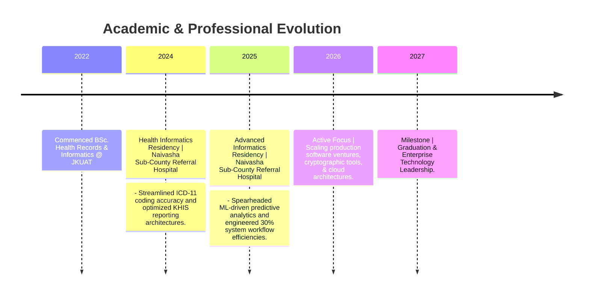
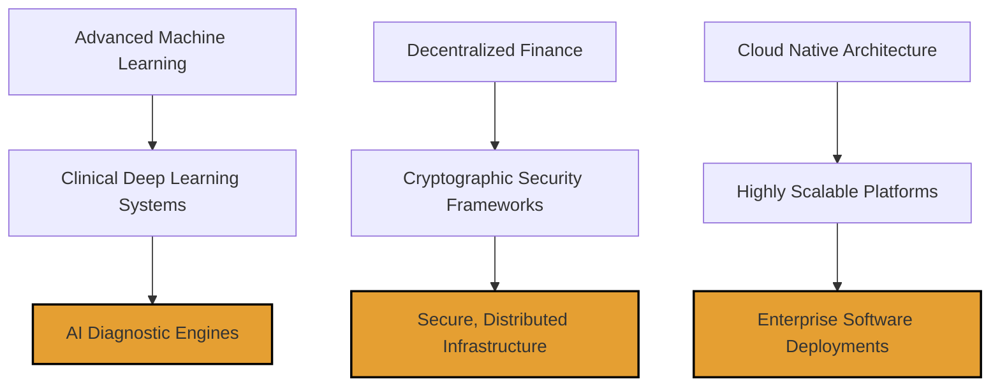

# Hi, I'm Samuel Macharia 👋

  

## 📌 Executive Summary

> **"Bridging clinical complexity and software engineering to architect secure, data-driven digital health ecosystems."**

I am a **Software Engineer** and **Health Informatics Specialist** pursuing my BSc. in Health Records and Informatics at **Jomo Kenyatta University of Agriculture and Technology (JKUAT)**. My core expertise sits at the intersection of robust web architecture, cryptographic data protection, and modern healthcare interoperability systems.

Driven by a passion for technical autonomy and systems thinking, I build highly efficient tools that turn complex clinical datasets into clear, actionable insights while maintaining strict compliance and zero-breach security.

---

## ⚡ Quick Metrics & Focus

*   **🔭 Current Initiatives:** Scaling robust enterprise applications, building cryptographic utilities, and deploying intelligent clinical automation dashboards.
*   **🧠 Deepening Knowledge:** Cloud Native Engineering (AWS/GCP), Advanced Applied Machine Learning, and Decentralized Architecture.
*   **🎯 Career Horizon:** Engineering resilient, secure software solutions that solve infrastructural challenges and accelerate digital transformation across Africa.

---

## 💼 Professional & Academic Milestones

### 📈 Career Velocity

### 🛠️ Hands-on Impact Tracking

| Role / Milestone | Institution | Core Focus Area | Status |
| --- | --- | --- | --- |
| **Advanced Health Informatics Resident** | Naivasha Sub-County Referral Hospital | ML Diagnostics, Security Frameworks & Systems Integration | **Completed (Aug 2025)** |
| **Health Informatics Associate** | Naivasha Sub-County Referral Hospital | EHR Infrastructure, ICD-11 Indexing & KHIS Analytics | **Completed (Jul 2024)** |
| **BSc. Health Records & Informatics** | JKUAT | Biostatistics, Epidemiology, Enterprise Health IT Architecture | **In Progress (Expected 2027)** |

---

## 🚀 Key Residency Highlights

* **Clinical Workflow Optimization:** Engineered system architectures that improved patient data retrieval and throughput velocity by **30%**.
* **Data Science Integration:** Deployed predictive machine learning models to forecast patient admission trends and support clinical diagnostics.
* **Information Security & Governance:** Upgraded hospital data access layers with stringent role-based access control (RBAC) to ensure total compliance with data protection laws.
* **Leadership & Mentorship:** Directed and managed a team of junior informatics interns, hosting technical workshops on data literacy and EHR mechanics.

* **Medical Coding Precision:** Maintained a **100% precision rating** indexing clinical encounters utilizing the ICD-11 classification framework.
* **National Level Reporting:** Aggregated and sanitized monthly institutional data pipelines for seamless deployment into the Kenya Health Information System (KHIS).
* **Data Integrity Uplift:** Implemented rigorous data validation protocols that reduced record incompleteness by **25%**.

---

## 🧰 Technical Arsenal

---

## 📈 Engineering Footprint

---

## 🎯 Tactical Learning Map & 2026-2027 Objectives

* [ ]  Complete Senior Capstone Research Project applying deep learning to specialized health datasets.
* [ ]  Publish production-grade open-source modules targeting data security and modern web scalability.
* [ ]  Secure professional-tier AWS Cloud Architecture credentials.
* [x]  Architect, launch, and scale a major software tech startup into production.
* [ ]  Graduate First-Class BSc. in Health Records and Informatics (2027).

---

## 🤝 Let's Connect & Collaborate

I am always open to strategic engineering roles, technical partnerships, and high-impact software build collaborations. Let's create something intentional.
