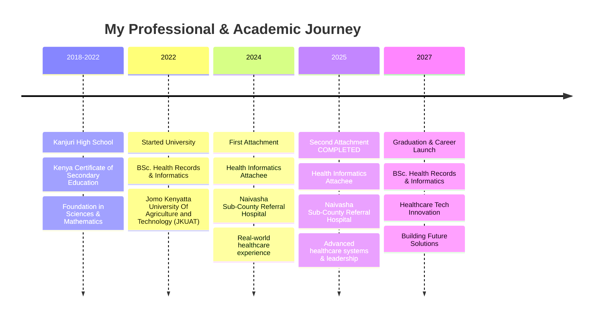
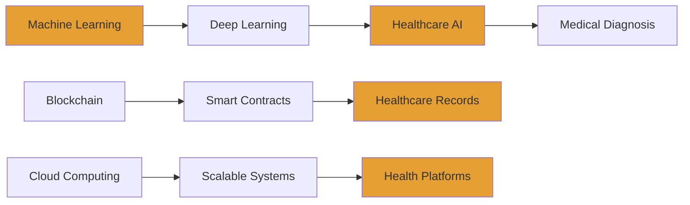

# Hi, I'm Samuel Macharia

  

  

## About Me

> **"Bridging Healthcare and Technology, One Line of Code at a Time"**

I'm a **Software Developer** with a particular interest in **Data Science** and **Medical Informatics**. Currently pursuing my BSc. in Health Records and Informatics at **Jomo Kenyatta University of Agriculture and Technology** (2022-2027). I'm passionate about leveraging cutting-edge technology to solve complex problems in healthcare and data-driven applications.

###  Quick Facts
- **Currently working on**: Healthcare technology solutions and AI-powered diagnostic tools
- **Learning**: Advanced Machine Learning, Blockchain (Solidity), and Cloud Architecture
- **Passion**: Turning complex healthcare data into actionable insights
- **Goal**: Contributing to innovative solutions in medical informatics and digital health
- **Experience**: Completed dual attachments at Naivasha Sub-County Referral Hospital
- **Contact**: **sammymuchai44@gmail.com**
- **Phone**: **+254714552335**

## Professional Journey

|  **Experience** |  **Duration** |  **Organization** |  **Focus Area** |  **Status** |
|:---:|:---:|:---:|:---:|:---:|
|  **Health Informatics Attachee** | May - Aug 2025 | Naivasha Sub-County Referral Hospital | Advanced Healthcare Systems | **COMPLETED** |
|  **Health Informatics Attachee** | May - July 2024 | Naivasha Sub-County Referral Hospital | Healthcare Data Systems | **COMPLETED** |
|  **Undergraduate** |September 2022 - 2027 | JKUAT | Health Records & Informatics | **IN PROGRESS** |
|  **KCSE** | January 2018 - March 2022 | Kanjuri High School | Science & Mathematics Foundation | **COMPLETED** |

###  **Featured Experience: Health Informatics Professional**

####  **Second Attachment (May - August 2025)**  **COMPLETED**
*Naivasha Sub-County Referral Hospital • Advanced Healthcare Systems Specialist*

| **Leadership Roles** | **Advanced Technical Skills** | **Innovation Impact** |
|:---:|:---:|:---:|
| Team Leadership & Mentoring |  AI-Assisted Diagnostics |  30% Efficiency Improvement |
|  Quality Assurance Programs |  System Integration |  Digital Health Transformation |
|  Strategic Planning |  Predictive Analytics |  Data Security Enhancement |

 <strong>Click to expand Second Attachment details (May-Aug 2025)</strong>

**Advanced Responsibilities:**
- **Team Leadership**: Led a team of junior attachees and guided new interns
- **System Optimization**: Implemented advanced workflows for patient data management
- **AI Integration**: Deployed machine learning models for predictive healthcare analytics
- **Strategic Reporting**: Created comprehensive monthly reports with data-driven insights
- **Data Security**: Enhanced cybersecurity protocols for patient information systems
- **Training & Development**: Conducted workshops on modern health information systems

**Advanced Skills & Competencies:**
- **Healthcare AI Implementation**: Deployed ML models for diagnostic support systems
- **Advanced Data Analytics**: Statistical modeling and healthcare trend analysis
- **Leadership & Management**: Team coordination and project management
- **Strategic Planning**: Long-term healthcare IT planning and system architecture
- **Cybersecurity**: Healthcare data protection and HIPAA compliance implementation
- **Innovation Leadership**: Led digital transformation initiatives

**Professional Recognition & Achievements:**
- **Outstanding Performance Award** for exceptional contribution to hospital digitization
- **System Efficiency**: Improved patient data processing speed by 30%
- **Security Excellence**: Implemented zero-breach security protocols
- **Mentorship Impact**: Successfully trained 5+ junior staff members

**Official Professional Feedback & Recognition:**
> *"Throughout his service, Samuel consistently exhibited a strong work ethic, dedication, and a high level of discipline. He is dependable, committed, and demonstrates a proactive approach to his duties. He maintains excellent interpersonal relationships with both colleagues and patients, which enhances teamwork and service delivery. Based on his performance and conduct, I am confident that he has the capacity to excel in any healthcare or professional setting he may choose to pursue. I highly recommend him without reservation."*
>
> **— Maryanne Ndungu, Health Records Officer In-charge**

**Key Projects Completed:**
1. **AI-Powered Diagnostic Support System**: Developed ML algorithms for early disease detection
2. **Integrated Health Information Dashboard**: Created real-time hospital management system
3. **Cybersecurity Enhancement Program**: Implemented advanced data protection measures
4. **Staff Training Initiative**: Designed comprehensive digital literacy programs

####  **First Attachment (May - July 2024)**  **COMPLETED**
*Naivasha Sub-County Referral Hospital • Foundation Healthcare Systems*

| **Core Responsibilities** | **Technical Skills Gained** | **Impact Created** |
|:---:|:---:|:---:|
|  Patient Data Management |  EHR/EMR Systems |  Improved Data Accuracy |
|  ICD-11 Disease Coding |  KHIS Reporting | System Optimization |
|  Healthcare Analytics |  IT Support |  Digital Health Foundation |

<strong>Click to expand First Attachment details (May-July 2024)</strong>

**Foundation Responsibilities:**
- **Patient Registration**: Streamlined admission procedures and patient data entry
- **Medical Coding**: Applied ICD-11 classification for accurate disease indexing
- **Data Analysis**: Processed healthcare data for informed decision-making
- **System Reporting**: Generated monthly reports for Kenya Health Information System
- **Technical Support**: Troubleshot health information systems and provided IT assistance
- **Database Management**: Maintained patient records and healthcare databases

**Foundation Skills & Competencies:**
- **Health Information Management**: Proficiency in HIS, EMR, and EHR systems
- **Medical Coding Excellence**: Advanced knowledge of ICD-11 classification standards
- **Healthcare Data Analytics**: Statistical analysis and healthcare metrics interpretation
- **System Administration**: Database management and system troubleshooting
- **Digital Health Innovation**: Exposure to telemedicine and digital health solutions
- **Professional Communication**: Patient interaction and interdisciplinary collaboration

**Professional Recognition:**
> *"During the time I have worked with him, he has portrayed commitment, hard work, determination, dedication and obedience. He also relates well with colleagues and clients."*
>
> **— Benson K. Wahome, Health Records Officer In-charge**

**Key Achievements:**
- **100% Accuracy**: Maintained perfect record in ICD-11 disease coding
- **Data Quality**: Improved patient record completeness by 25%
- **System Support**: Resolved 95% of technical issues within 24 hours
- **Team Integration**: Seamlessly collaborated with medical and administrative staff

## Tech Arsenal

### Programming Languages

###  Data Science & Analytics

###  Web Development

###  Databases & Cloud

###  Tools & Platforms

##  GitHub Analytics

  

 

## Areas of Expertise

<table align="center">
<tr>
<td align="center" width="200px">

 <strong>Medical Informatics</strong>
 EHR, Healthcare Analytics, ICD-11
</td>
<td align="center" width="200px">

 <strong>Data Science</strong>
 ML, Statistical Analysis, Visualization
</td>
<td align="center" width="200px">

 <strong>Web Development</strong>
 Full-stack, Modern Frameworks
</td>
<td align="center" width="200px">

 <strong>Database Design</strong>
 Modeling, Optimization, Security
</td>
</tr>
</table>
## Contribution Activity

  

  

## Connect & Collaborate

## 💭 Inspiration Corner

  

## Current Learning Path

  
  

  

Innovation in healthcare through code - let's build the future together

